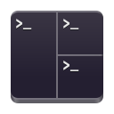
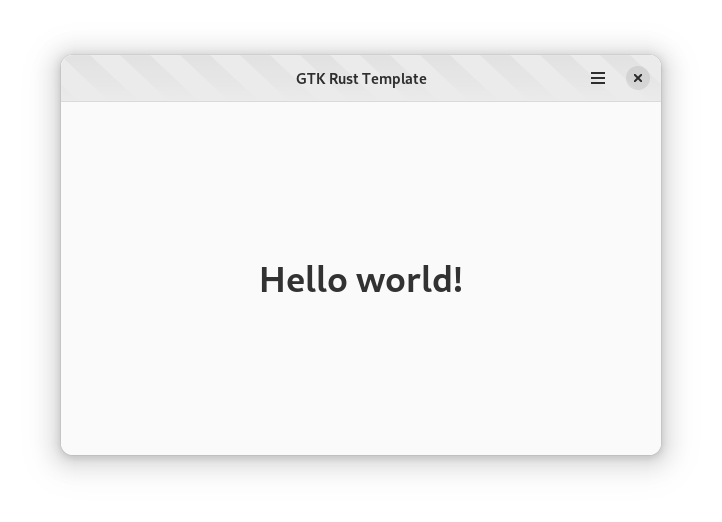

<div align="center">
  <h1>Terms</h1>

  <h4>A tiling terminal emulator for GNOME</h4>
  <p>
    <!-- <a href="#features">Features</a> •
    <a href="#install">Install</a> •
    <a href="#gallery">Gallery</a> •
    <a href="./CHANGELOG.md">Changelog</a> -->
    <br/>
    <!-- <a href="https://github.com/vhdirk/terms/-/wikis/home">Wiki</a> • -->
    <a href="./LICENSE">License</a> •
    <!-- <a href="./CONTRIBUTING.md">Contributing</a> -->
  </p>
  <p>
  </p>

</div>


<!-- <div align="center">


</div> -->

## Goal

Terms is an experiment. I like [Tilix][Tilix] and I like [BlackBox]. Why can't I have both?
Terms uses GTK4 and is written in Rust. The latter has no added value aside from the fact that I like it.

## Status

Terms is still very much in development. The following features are present but may still need some work to stabilize.

- [x] Multiple windows
- [x] Drag/drop support
- [x] href/mailto regex matching
- [x] Settings
- [x] Theming. Compatible with Gogh
- [x] Flatpak support
- [x] Shortcuts
- [x] Tabs
- [ ] Tiling
- [ ] Profiles
- [ ] Store and load session like Tilix and Prompt do
- [ ] tmux Control Mode, based on <https://github.com/gnome-terminator/terminator/pull/408> and <https://github.com/iamjackg/terminator/tree/tmux-v2>


<!-- ## Building the project

Make sure you have `flatpak` and `flatpak-builder` installed. Then run the commands below. Replace `io.github.vhdirk.Terms` with the value you entered during project creation. Please note that these commands are just for demonstration purposes. Normally this would be handled by your IDE, such as GNOME Builder or VS Code with the Flatpak extension.

```
flatpak install org.gnome.Sdk//44 org.freedesktop.Sdk.Extension.rust-stable//22.08 org.gnome.Platform//43
flatpak-builder --user flatpak_app build-aux/io.github.vhdirk.Terms.Devel.json
```

## Running the project

Once the project is build, run the command below. Replace Replace `io.github.vhdirk.Terms` and `<project_name>` with the values you entered during project creation. Please note that these commands are just for demonstration purposes. Normally this would be handled by your IDE, such as GNOME Builder or VS Code with the Flatpak extension.

```
flatpak-builder --run flatpak_app build-aux/io.github.vhdirk.Terms.Devel.json <project_name>
``` -->

## Credits

Lots of ideas and code is ~~stolen~~ borrowed from these projects:

- [BlackBox]
- [Tilix]
- [Fractal]
- [Zoha]
- [Prompt]
- [Terminator]

Attribution is added in code.

[BlackBox]: https://gitlab.gnome.org/raggesilver/blackbox
[Tilix]: https://github.com/gnunn1/tilix
[Fractal]: https://gitlab.gnome.org/World/fractal
[Zoha]: https://github.com/hkoosha/zoha4
[Prompt]: https://gitlab.gnome.org/chergert/prompt
[Terminator]: https://github.com/gnome-terminator/terminator
