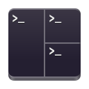
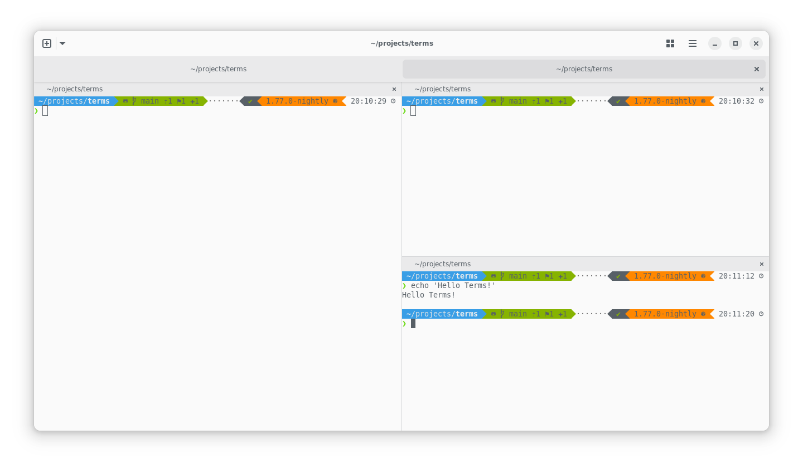

  <h1>Terms</h1>

  <h4>A tiling terminal emulator for GNOME</h4>
  

    <!-- <a href="#features">Features</a> •
    <a href="#install">Install</a> •
    <a href="#gallery">Gallery</a> •
    <a href="./CHANGELOG.md">Changelog</a> -->
     
    <a href="https://vhdirk.github.io/terms/">Docs</a> •
    <a href="./LICENSE">License</a> •
    <a href="./CONTRIBUTING.md">Contributing</a>
  

  

  

## Goal

Terms is an experiment. I like [Tilix][Tilix] and I like [BlackBox]. Why can't I have both?
Terms uses GTK4 and is written in Rust. The latter has no added value aside from the fact that I like it.

## Status

Terms is still very much in development. The following features are present but may still need some work to stabilize.

- [x] Multiple windows
- [x] Drag/drop support
- [x] href/mailto regex matching
- [x] Settings
- [x] Theming. Compatible with Gogh
- [x] Flatpak support
- [x] Shortcuts
- [x] Tabs
- [ ] Tiling
- [ ] Profiles
- [ ] Store and load session like Tilix and Prompt do
- [ ] tmux Control Mode, based on <https://github.com/gnome-terminator/terminator/pull/408> and <https://github.com/iamjackg/terminator/tree/tmux-v2>

## Credits

The following projects gave me _lots_ of ideas.
Many files are derived work (ported to rust) or even plainly copied from these.

- [BlackBox]
- [Tilix]
- [Fractal]
- [Zoha]
- [Prompt]
- [Terminator]

I strive to properly attribute and give credit to the original authors. If you feel like
I have missed some things, that some things look very familiar but have no attribution,
please let me know! This project would not exist without you!

[BlackBox]: https://gitlab.gnome.org/raggesilver/blackbox
[Tilix]: https://github.com/gnunn1/tilix
[Fractal]: https://gitlab.gnome.org/World/fractal
[Zoha]: https://github.com/hkoosha/zoha4
[Prompt]: https://gitlab.gnome.org/chergert/prompt
[Terminator]: https://github.com/gnome-terminator/terminator
